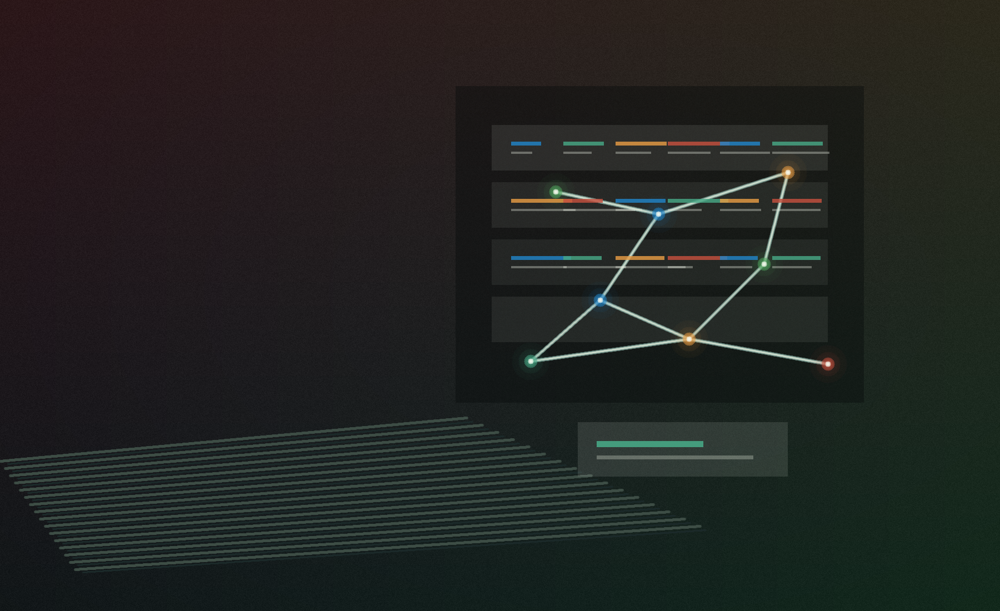
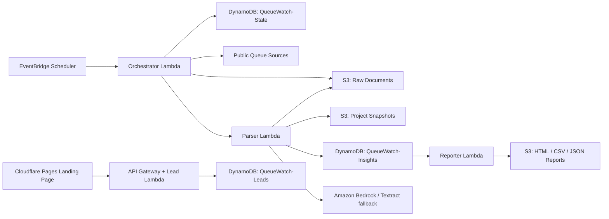

# QueueWatch

QueueWatch is a production AWS serverless data product that watches public utility interconnection queues, detects real source changes, normalizes project rows, and turns messy grid-capacity data into buyer-ready signals.

Live site: [queuewatch.pages.dev](https://queuewatch.pages.dev)



## Why This Exists

Power availability is now a deal constraint for data centers, renewables, storage, and infrastructure investors. The public signals already exist, but they are buried in utility queue PDFs, spreadsheets, XML files, CSV exports, and old public portals.

Teams that find a 50-200 MW queue opening early can move on land, acquisition, or project origination before competitors notice. Teams that rely on manual queue research usually see the same signal late.

QueueWatch closes that gap.

## Who It Is For

- Data center site selection teams looking for power-constrained markets with available capacity.
- Renewable and storage developers tracking interconnection movement by node, MW, status, and developer.
- Infrastructure investors watching secondary-market project signals, queue withdrawals, and stranded land risk.
- Cloud and data engineering recruiters evaluating practical AWS, Python, Terraform, and LLM systems work.

## What It Does

QueueWatch monitors official public sources, captures every changed document, extracts project-level records, compares them against the previous snapshot, and produces source-backed intelligence reports.

Current production coverage:

- 8 official ISO/RTO sources across CAISO, MISO, SPP, PJM, NYISO, ERCOT, and ISO-NE.
- 15,800 normalized project rows snapshotted from structured XLSX, CSV, XML, and HTML sources.
- 175 high-capacity baseline project signals generated from the live production run.
- Raw source files, row fingerprints, parser status, review status, and report artifacts stored for auditability.
- Live Cloudflare Pages landing page with serverless lead capture.

## The Buyer Pain

Public interconnection queues are painful because they are:

- Scattered across inconsistent utility and ISO/RTO portals.
- Published in formats that do not behave like clean APIs.
- Updated on uneven schedules with weak change visibility.
- Too large to review manually every day.
- Commercially valuable only when changes are found early.

QueueWatch turns that workflow from "open a pile of queue files and hunt manually" into "review the project deltas that changed since the last snapshot."

## Example Signal

```json
{
  "insight_type": "PROJECT_DELTA",
  "delta_type": "UPDATED",
  "market": "PJM",
  "interconnection_queue_id": "AE2-417",
  "capacity_mw": 175,
  "substation_or_node": "Oak Creek 230 kV",
  "status": "Active",
  "developer_name": "Example Solar LLC",
  "raw_s3_key": "raw/pjm-planning-queues/...",
  "record_fingerprint": "sha256:..."
}
```

## Architecture

QueueWatch is intentionally built with zero-idle AWS primitives. There are no long-running servers and no provisioned search clusters.



Core services:

- AWS Lambda for orchestration, parsing, reporting, and lead capture.
- DynamoDB on-demand for source state, insights, and captured leads.
- S3 for raw documents, normalized project snapshots, and generated reports.
- EventBridge Scheduler for daily source checks and reports.
- Amazon Bedrock for LLM extraction where deterministic parsing is not enough.
- Amazon Textract fallback for weak or scanned PDF extraction.
- SQS DLQs and CloudWatch alarms for operational failure visibility.
- Terraform for reproducible infrastructure.
- Cloudflare Pages for the public landing page.

## How It Works

1. The orchestrator loads active source targets from `QueueWatch-State`.
2. It performs a cheap fingerprint check using ETag, `Last-Modified`, content length, or bounded GET probes.
3. Only changed sources are downloaded to S3.
4. The parser normalizes structured queue sources into project rows.
5. Project rows are stored as S3 snapshots and compared against the previous snapshot.
6. New, updated, removed, and baseline signals are written to `QueueWatch-Insights`.
7. The reporter creates buyer-facing HTML, CSV, and JSON reports.
8. The landing page captures pilot requests into a serverless lead table.

## What Makes This More Than A Demo

- It uses real public utility queue sources, not mock data.
- It handles multiple production formats: XLSX, CSV, XML, HTML, PDF fallback.
- It separates cheap change detection from expensive parsing and LLM invocation.
- It stores raw source evidence and normalized project snapshots for auditability.
- It has DLQs, alarms, log retention, S3 encryption, bucket public access blocking, and least-scope IAM policies.
- It is already deployed on AWS and Cloudflare Pages.

## Repository Map

| Path | Purpose |
| --- | --- |
| `main.tf` | Terraform for Lambda, DynamoDB, S3, IAM, EventBridge, API Gateway, alarms, and DLQs. |
| `orchestrator.py` | Source scanner, fingerprint checker, raw S3 capture, async parser invocation. |
| `parser.py` | Deterministic project-row extraction, snapshot comparison, Bedrock/Textract fallback, insight persistence. |
| `reporter.py` | Buyer-facing HTML, CSV, and JSON report generation. |
| `lead_capture.py` | Serverless landing-page pilot request capture. |
| `seed_queues.py` | CSV/JSON utility source seeding for `QueueWatch-State`. |
| `queues.production.csv` | Real production source catalog. |
| `docs/source-coverage.md` | Current official source coverage and operational notes. |
| `landing/` | Cloudflare Pages landing page. |
| `tests/` | Unit tests for orchestration, parsing, reporting, seeding, and lead validation. |

## Production Source Coverage

The current catalog monitors official sources from:

- CAISO public queue report and Cluster 15 workbook.
- MISO ERAS interconnection requests workbook.
- SPP active generator interconnection CSV.
- PJM planning queue XML.
- NYISO interconnection queue workbook.
- ERCOT GIS report resolved from the public ICE document list.
- ISO-NE public queue portal HTML.

See [docs/source-coverage.md](docs/source-coverage.md) for details and limitations.

## Current Limitations

This is strong enough for a paid pilot, but not a finished enterprise SaaS product.

- CAISO public queue PDF still uses text/OCR plus Bedrock fallback instead of a dedicated PDF table parser.
- There is no authenticated customer dashboard yet.
- Billing, account management, and self-serve onboarding are not implemented.
- The current report flow is operationally useful, but buyer-specific saved territories and alert preferences are still future work.

## Deploy

```bash
terraform init
terraform plan
terraform apply
```

Optional email alarm subscription:

```bash
terraform apply -var='alarm_email=you@example.com'
```

Optional report email delivery and lead notifications require verified SES sender identities:

```bash
terraform apply \
  -var='report_sender_email=reports@example.com' \
  -var='report_recipient_emails=buyer@example.com,analyst@example.com' \
  -var='lead_sender_email=leads@example.com' \
  -var='lead_notification_email=founder@example.com'
```

If you use a different Bedrock region/model, override the model ID:

```bash
terraform apply \
  -var='aws_region=us-east-1' \
  -var='bedrock_model_id=us.anthropic.claude-haiku-4-5-20251001-v1:0'
```

## Seed Queue Targets

Seed the production source catalog:

```bash
python3 seed_queues.py --file queues.production.csv --region us-east-1
```

Seed the smoke-test source:

```bash
python3 seed_queues.py --file queues.example.csv --region us-east-1
```

Seed one target:

```bash
python3 seed_queues.py \
  --queue-id dominion-nova \
  --source-url 'https://utility.example/interconnection-queue.xlsx' \
  --utility-name 'Dominion Energy' \
  --region us-east-1
```

The seeder updates target fields without deleting runtime fields such as hashes, S3 object keys, parser status, or previous errors.

## Smoke Test

```bash
aws lambda invoke \
  --function-name queuewatch-orchestrator \
  --payload '{}' \
  response.json \
  --cli-binary-format raw-in-base64-out

cat response.json
```

Inspect output:

```bash
aws dynamodb scan --table-name QueueWatch-State
aws dynamodb scan --table-name QueueWatch-Insights
aws s3 ls "s3://$(terraform output -raw raw_bucket_name)/raw/" --recursive
aws s3 ls "s3://$(terraform output -raw raw_bucket_name)/project-snapshots/" --recursive
aws s3 ls "s3://$(terraform output -raw raw_bucket_name)/reports/" --recursive
```

Check DLQs:

```bash
aws sqs get-queue-attributes \
  --queue-url "$(terraform output -raw orchestrator_dlq_url)" \
  --attribute-names ApproximateNumberOfMessages

aws sqs get-queue-attributes \
  --queue-url "$(terraform output -raw parser_dlq_url)" \
  --attribute-names ApproximateNumberOfMessages
```

Generate the buyer-facing daily report manually:

```bash
aws lambda invoke \
  --function-name queuewatch-reporter \
  --payload '{}' \
  report-response.json \
  --cli-binary-format raw-in-base64-out

cat report-response.json
```

Check captured pilot leads:

```bash
aws dynamodb scan --table-name QueueWatch-Leads
```

## Landing Page

The end-user marketing site lives in `landing/` and is deployable as a static Cloudflare Pages site.

Local preview:

```bash
python3 -m http.server 8788 --directory landing
```

Deploy:

```bash
npx wrangler@latest pages deploy landing --project-name queuewatch --branch main
```

Production URL:

```text
https://queuewatch.pages.dev
```
